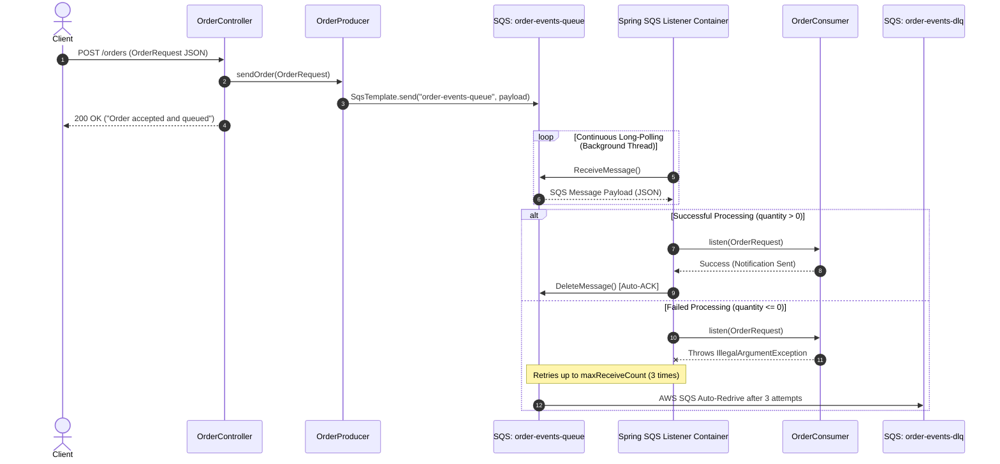
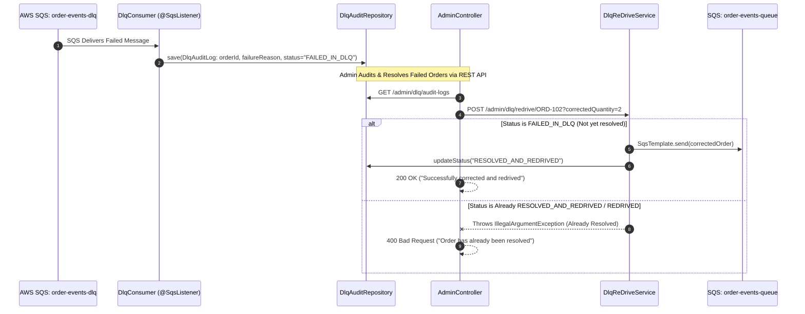

# Order Notification System (Spring Boot + AWS SQS + DLQ + Redrive Audit)

A production-ready asynchronous event-driven Spring Boot microservice demonstrating AWS SQS integration, Spring Cloud AWS 3.x, Dead Letter Queue (DLQ) retry & redrive policies, automated DLQ failure auditing, and Global REST Exception Handling.

---

## 🏗️ Architecture Overview

### 1. Main Queue & Failure Flow



---

### 2. DLQ Auditing & Redrive Architecture



---

## ⚙️ How Spring & AWS SQS Work Together

### 1. Producer (`OrderProducer`)
- Injects Spring Cloud AWS `SqsTemplate`.
- Serializes Java objects (`OrderRequest`) to JSON automatically and publishes them to `order-events-queue`.

### 2. Consumer (`OrderConsumer`)
- Uses `@SqsListener("${app.queue.order-events}")`.
- Spring creates a background `MessageListenerContainer` daemon thread that continuously long-polls SQS.
- Automatically deserializes incoming JSON payloads into `OrderRequest` objects using Jackson.
- **Auto-ACK on Success**: If the method finishes without error, Spring issues a `DeleteMessage` request to AWS SQS.
- **Retry on Exception**: If an exception is thrown, Spring leaves the message in SQS. After the 30s `VisibilityTimeout`, SQS retries delivery.

### 3. Dead Letter Queue (DLQ) & DLQ Consumer (`DlqConsumer`)
- Configured via AWS `RedrivePolicy` with `maxReceiveCount = 3`.
- After 3 unsuccessful consumer attempts, AWS SQS moves the failed message to `order-events-dlq`.
- `DlqConsumer` listens to `@SqsListener("${app.queue.order-events-dlq}")`, automatically captures failed messages, extracts failure metadata, and stores an audit record in `DlqAuditRepository` with status `"FAILED_IN_DLQ"`.

---

## 🛠️ AWS Resource Provisioning Commands (AWS CLI)

Run these commands in your shell to set up your AWS SQS infrastructure:

### 1. Create the Dead Letter Queue (DLQ)
```bash
aws sqs create-queue --queue-name order-events-dlq
```

### 2. Retrieve the DLQ ARN
```bash
DLQ_URL=$(aws sqs get-queue-url --queue-name order-events-dlq --query 'QueueUrl' --output text)
DLQ_ARN=$(aws sqs get-queue-attributes --queue-url "$DLQ_URL" --attribute-names QueueArn --query 'Attributes.QueueArn' --output text)
```

### 3. Create the Main Queue with DLQ Redrive Policy attached
```bash
aws sqs create-queue \
  --queue-name order-events-queue \
  --attributes '{
    "VisibilityTimeout": "30",
    "RedrivePolicy": "{\"deadLetterTargetArn\":\"'"$DLQ_ARN"'\",\"maxReceiveCount\":\"3\"}"
  }'
```

---

## 🚀 How to Run & Test

### 1. Start the Spring Boot Application
```bash
./mvnw spring-boot:run
```

### 2. Test Success Path (Valid Order)
Send a request with `quantity > 0`:
```bash
curl -X POST http://localhost:8080/orders \
  -H "Content-Type: application/json" \
  -d '{
    "orderId": "ORD-101",
    "productId": "PROD-99",
    "quantity": 2
  }'
```
**Expected Outcome**: 
- HTTP 200 OK.
- Application logs: `Notification sent successfully for order: ORD-101`.
- Message is processed and automatically deleted from `order-events-queue`.

### 3. Test DLQ Redirection (Invalid Order)
Send a request with `quantity <= 0`:
```bash
curl -X POST http://localhost:8080/orders \
  -H "Content-Type: application/json" \
  -d '{
    "orderId": "ORD-102",
    "productId": "PROD-88",
    "quantity": 0
  }'
```
**Expected Outcome**:
- Consumer throws `IllegalArgumentException`.
- Retried 3 times (visible in logs).
- AWS automatically moves the failed message to `order-events-dlq`.
- `DlqConsumer` captures the failed order and logs it into `DlqAuditRepository`.

---

## 🔄 DLQ Redrive & Admin Management APIs

This microservice implements automated DLQ failure auditing, data correction, and duplicate-prevention redrive APIs:

### 1. View Audited DLQ Messages (`GET /admin/dlq/audit-logs`)
Lists all failed messages captured from the DLQ along with their audit metadata:
```bash
curl http://localhost:8080/admin/dlq/audit-logs
```
**Sample JSON Response**:
```json
[
  {
    "orderId": "ORD-102",
    "productId": "PROD-88",
    "quantity": 0,
    "failureReason": "Quantity is invalid (0) - Failed 3 retries in main queue",
    "status": "FAILED_IN_DLQ",
    "failedAt": "2026-09-13T20:23:45",
    "redrivedAt": null
  }
]
```

### 2. Batch Redrive Messages (`POST /admin/dlq/redrive`)
Pulls up to `maxMessages` directly from `order-events-dlq` and re-publishes them to `order-events-queue`:
```bash
curl -X POST "http://localhost:8080/admin/dlq/redrive?maxMessages=5"
```

### 3. Target & Correct Specific Failed Order (`POST /admin/dlq/redrive/{orderId}`)
Allows administrators to fix payload values (e.g. `correctedQuantity=2`) for a specific order in the audit store and push it back to `order-events-queue`:
```bash
curl -X POST "http://localhost:8080/admin/dlq/redrive/ORD-102?correctedQuantity=2"
```
**Response**: `"Successfully corrected and redrived order [ORD-102] to main queue"`

#### 🛡️ Safety & Duplicate Redrive Prevention
If an administrator attempts to call `POST /admin/dlq/redrive/ORD-102` a second time for an order that has **already been resolved**:
- **Response**: HTTP `400 Bad Request`
- **Body**: `"Order [ORD-102] has already been resolved and redrived on 2026-09-13T20:44:12"`
- Prevents infinite reprocessing loops and duplicate notifications.

---

## 🔍 AWS SQS Inspection & Maintenance Commands

### Check Message Counts
```bash
# Check DLQ Message Count
aws sqs get-queue-attributes \
  --queue-url $(aws sqs get-queue-url --queue-name order-events-dlq --query 'QueueUrl' --output text) \
  --attribute-names ApproximateNumberOfMessages

# Check Main Queue Message Count
aws sqs get-queue-attributes \
  --queue-url $(aws sqs get-queue-url --queue-name order-events-queue --query 'QueueUrl' --output text) \
  --attribute-names ApproximateNumberOfMessages
```

### Receive & View Messages from DLQ
```bash
aws sqs receive-message \
  --queue-url $(aws sqs get-queue-url --queue-name order-events-dlq --query 'QueueUrl' --output text) \
  --max-number-of-messages 1
```

### Manually Delete a Message from DLQ
```bash
aws sqs delete-message \
  --queue-url $(aws sqs get-queue-url --queue-name order-events-dlq --query 'QueueUrl' --output text) \
  --receipt-handle "<RECEIPT_HANDLE_FROM_RECEIVE_MESSAGE>"
```

---

## 💡 Production Improvements & Architecture Enhancements

To upgrade this implementation into an enterprise-grade distributed system, consider implementing these key architectural patterns:

### 1. LocalStack Integration for Local Development & CI/CD
Instead of connecting to actual AWS Cloud during local dev and automated unit/integration tests, configure **LocalStack** (AWS emulator in Docker):
```yaml
# application-local.yml
spring:
  cloud:
    aws:
      sqs:
        endpoint: http://localhost:4566
```

### 2. Message Idempotency & Deduplication
To prevent duplicate processing if SQS delivers a message more than once (at-least-once delivery guarantee):
- Use **Redis** or a database table (`processed_messages`) storing `orderId`.
- In `OrderConsumer`, check if `orderId` was already processed before sending notifications.

### 3. SNS + SQS Fan-Out Pattern (Pub/Sub)
If multiple microservices need to react to order events (e.g. Email Service, Inventory Service, Analytics Service):
- Publish events to an **AWS SNS Topic** (`order-events-topic`).
- Subscribe multiple SQS queues (`order-notification-queue`, `inventory-update-queue`, `analytics-queue`) to the SNS topic.

### 4. SQS FIFO Queues (First-In-First-Out)
If strict message ordering is required per customer (e.g., `ORDER_CREATED` $\rightarrow$ `ORDER_PAID` $\rightarrow$ `ORDER_SHIPPED`):
- Switch to FIFO Queue (`order-events.fifo`).
- Pass `MessageGroupId` (e.g., `customerId`) to ensure sequential processing.

### 5. Observability & Distributed Tracing (Actuator + CloudWatch + Micrometer)
- Integrate `spring-boot-starter-actuator` and Micrometer tracing (Zipkin / AWS X-Ray) to trace requests end-to-end from REST call to SQS consumer execution.
